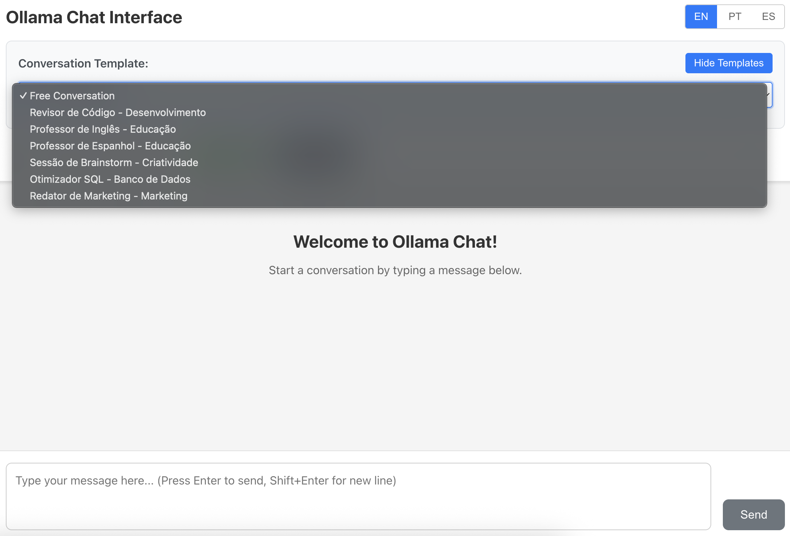

# Ollama Chat Interface

A simple and clean web interface for interacting with Ollama directly via HTTP API. This application provides a modern chat interface with model selection, internationalization support, comprehensive testing, and Docker support.




## Features

- 🚀 **Modern Chat Interface**: Clean, responsive design with markdown support
- 🔄 **Model Selection**: Dynamic model selector showing all available Ollama models
- 🌍 **Internationalization**: Support for Portuguese and English (easily extensible to other languages)
- 📱 **Responsive Design**: Works seamlessly on desktop and mobile devices
- ⚡ **Real-time Status**: Connection status indicator for Ollama
- 🧹 **Session Management**: Clear chat functionality and message history
- ⌨️ **Keyboard Shortcuts**: Enter to send, Shift+Enter for new lines
- 🎯 **Error Handling**: Graceful handling of connection issues and errors
- 🧪 **Comprehensive Testing**: Unit tests, integration tests, and E2E tests with Playwright
- 🐳 **Docker Ready**: Full Docker support with docker-compose

## Tech Stack

### Frontend
- React 18 with TypeScript
- **Modular Component Architecture** - Atomic Design principles (atoms, molecules, organisms)
- **Custom Hooks** - Separated logic with hooks like `useChat`, `useChatMessages`, `useChatInput`
- React i18next for internationalization
- Axios for API communication
- React Markdown for message rendering with enhanced features
- **Modern CSS** - CSS custom properties with design system tokens
- **Flexible UI Patterns** - Compatible with LlamaIndex Chat UI components

### Backend
- Node.js with Express
- TypeScript
- Direct HTTP API integration with Ollama
- CORS enabled for development
- Environment variable configuration

### Testing
- **Frontend**: Jest with React Testing Library
- **Backend**: Jest with Supertest for API testing
- **E2E**: Playwright for cross-browser testing
- **Coverage**: 80%+ code coverage requirement

## Prerequisites

- Node.js (v16 or higher)
- npm or yarn
- Ollama running locally on `localhost:11434`

## Installation

1. **Clone the repository**
   ```bash
   git clone <repository-url>
   cd ollm
   ```

2. **Install all dependencies**
   ```bash
   npm run install:all
   ```

3. **Configure environment variables**
   
   Copy the example environment file in the backend:
   ```bash
   cp backend/.env.example backend/.env
   ```
   
   Edit `backend/.env` to match your Ollama configuration:
   ```env
   PORT=4001
   OLLAMA_BASE_URL=http://localhost:11434
   DEFAULT_MODEL=llama2
   ```

## Development

> **Note**: Development uses ports 4000 (frontend) and 4001 (backend) to avoid conflicts with other projects. Docker uses the traditional ports 3000 and 3002.

### Quick Start (Recommended)
Run both frontend and backend simultaneously:
```bash
npm run dev
```

This will start:
- Frontend on `http://localhost:4000`
- Backend on `http://localhost:4001`

### Individual Services

**Frontend only:**
```bash
npm run dev:frontend
```

**Backend only:**
```bash
npm run dev:backend
```

## Testing

This project includes comprehensive testing at all levels:

### Running Tests

**All tests (recommended):**
```bash
npm run quality  # Runs type-check, lint, and all tests
```

**Individual test suites:**
```bash
# Unit tests only
npm test

# Frontend tests with coverage
npm run test:frontend

# Backend tests
npm run test:backend

# End-to-end tests
npm run test:e2e

# E2E tests with UI (for debugging)
npm run test:e2e:ui
```

### Test Structure

- **Frontend Tests**: Located in `frontend/src/**/__tests__/` and `*.test.tsx` files
  - Component tests with flexible selectors for modular architecture
  - Custom hooks tests (prepared for `useChat`, `useChatMessages`, etc.)
  - Integration tests between modular components
- **Backend Tests**: Located in `backend/src/**/__tests__/` and `*.test.ts` files  
- **E2E Tests**: Located in `e2e/` directory
  - Updated with robust selectors for component modularity
  - Compatible with future ChatHeader, ChatMessages, ChatInput components
  - Maintains backward compatibility during refactoring

### Code Quality

```bash
# Run linting
npm run lint

# Fix linting issues
npm run lint:fix

# TypeScript type checking
npm run type-check

# Security vulnerability audit
npm run security

# Fix security vulnerabilities (when possible)
npm run audit:fix
```

### Security Auditing

This project includes comprehensive security vulnerability scanning using `npm audit`:

```bash
# Run security audit on all packages
npm run security

# Run audit on specific components
npm run audit:frontend  # Frontend dependencies only
npm run audit:backend   # Backend dependencies only

# Attempt to fix vulnerabilities automatically
npm run audit:fix       # Fix all packages
npm run audit:fix:frontend  # Fix frontend only
npm run audit:fix:backend   # Fix backend only
```

**Security checks are integrated into:**
- Build process (`npm run build`)
- Pre-commit hooks (when package.json files change)
- Manual quality checks (`npm run security`)

## Production

### Build
```bash
npm run build
```

### Start Production Server
```bash
npm start
```

## Configuration

### Backend Configuration
Environment variables in `backend/.env`:

- `PORT` - Backend server port (default: 4001 for development)
- `OLLAMA_BASE_URL` - Ollama server URL (default: http://localhost:11434)
- `DEFAULT_MODEL` - Default model to use (default: llama2)
- `NODE_ENV` - Environment mode (development/production)
- `ENABLE_SWAGGER` - Enable/disable Swagger UI (default: enabled, set to 'false' to disable)

### Frontend Configuration
Create `frontend/.env` for frontend-specific variables:

```env
REACT_APP_API_URL=http://localhost:4001/api
```

## Using with Ollama

1. **Install Ollama** following the instructions at [ollama.ai](https://ollama.ai)

2. **Pull some models** (examples):
   ```bash
   ollama pull llama2
   ollama pull mistral
   ollama pull codellama
   ```

3. **Verify Ollama is running**:
   ```bash
   curl http://localhost:11434/api/tags
   ```

4. **Start the chat interface** and select your preferred model from the dropdown.

## API Documentation

### Swagger Documentation

The API includes interactive Swagger documentation for easy testing and integration:

**Access:** `http://localhost:4001/api-docs` (enabled by default)

#### Features
- **Interactive API Testing**: Test all endpoints directly from the browser
- **Schema Validation**: View request/response schemas for all endpoints
- **Live Documentation**: Automatically updated when endpoints change
- **Example Requests**: Pre-filled examples for quick testing

#### Endpoints Documented
- `GET /api/models` - List available AI models
- `GET /api/health` - Check service and Ollama connection status
- `POST /api/chat` - Send messages to AI models
- `GET /api/{templateSlug}` - Process templates with parameters

#### Using Swagger UI
1. **Start development server**: `npm run dev`
2. **Open Swagger UI**: Navigate to `http://localhost:4001/api-docs`
3. **Try endpoints**: Click "Try it out" on any endpoint
4. **View responses**: See live API responses and schema validation

#### Configuration
- **Default**: Swagger is **enabled** in all environments
- **Disable**: Set environment variable `ENABLE_SWAGGER=false` to disable
- **Docker**: Available at `http://localhost:3002/api-docs` in Docker containers

### API Integration Examples

**Get Available Models:**
```bash
curl http://localhost:4001/api/models
```

**Check Health Status:**
```bash
curl http://localhost:4001/api/health
```

**Send Chat Message:**
```bash
curl -X POST http://localhost:4001/api/chat \
  -H "Content-Type: application/json" \
  -d '{"message": "Hello, how are you?", "model": "llama2"}'
```

**Use Template (English Teacher):**
```bash
curl "http://localhost:4001/api/english-teacher?text=Hello world"
```

## Internationalization

The application supports multiple languages through react-i18next:

- **English** (default)
- **Portuguese** 

### Adding New Languages

1. Create a new translation file in `frontend/src/i18n/locales/[language_code].json`
2. Copy the structure from `en.json` and translate the values
3. Update `frontend/src/i18n/index.ts` to include the new language
4. Modify the `LanguageSwitcher` component to include the new language option

See `frontend/src/i18n/README_TRANSLATORS.md` for detailed instructions.

## Component Architecture

This project follows modern React patterns with atomic design principles:

### Component Structure
- **Atoms**: Basic UI elements (`Button`, `Input`, `Badge`, `Typography`)
- **Molecules**: Component combinations (`SearchBar`, `FilterDropdown`, `TemplateCard`)  
- **Organisms**: Complex components (`TemplateGrid`, `ModeSelector`, `TemplateFilters`)
- **Templates**: Page-level layouts (`ChatTemplate`, `TemplateSelectionTemplate`)

### Custom Hooks (Future Implementation)
- `useChat()` - Main chat state management
- `useChatMessages()` - Message list and auto-scroll
- `useChatInput()` - Input handling and keyboard shortcuts
- `useOllamaHealth()` - Health check and connection status
- `useModelSelector()` - Model loading and selection

### Design System
- **Tokens**: Spacing, colors, typography, breakpoints
- **Themes**: Light theme (dark theme ready)
- **Utilities**: Responsive helpers and common patterns

### LlamaIndex Compatibility
The architecture is designed to be compatible with LlamaIndex Chat UI patterns:
- Modular component approach
- Flexible theming with CSS variables
- Extensible message rendering
- Custom hook patterns for state management

## Project Structure

```
ollm/
├── frontend/           # React TypeScript application
│   ├── src/
│   │   ├── components/ # React components (modular architecture)
│   │   │   ├── atoms/      # Basic UI elements (Button, Input, etc.)
│   │   │   ├── molecules/  # Component combinations (SearchBar, etc.)
│   │   │   ├── organisms/  # Complex components (TemplateGrid, etc.)
│   │   │   ├── templates/  # Page-level templates
│   │   │   └── __tests__/  # Component tests
│   │   ├── hooks/      # Custom React hooks (useChat, useChatMessages)
│   │   ├── services/   # API services
│   │   ├── types/      # TypeScript types
│   │   └── i18n/       # Internationalization
├── backend/            # Node.js Express server
│   ├── src/
│   │   └── index.ts    # Main server file
│   └── .env            # Environment variables
├── e2e/               # End-to-end tests (Playwright)
├── .eslintrc.js       # ESLint configuration
├── package.json       # Root package.json with scripts
└── README.md
```

## API Endpoints

- `GET /api/health` - Check Ollama connection status
- `GET /api/models` - List available Ollama models
- `POST /api/chat` - Send message to Ollama model
- `GET /api/:templateSlug` - Template API with JSON response

## Template System

The application includes a powerful template system for predefined conversation starters with customizable parameters.

### Using Templates via Interface

Access templates through the web interface using URLs like:
```
http://localhost:4000/chat/{template-slug}?param1=value1&param2=value2
```

### Using Templates via JSON API

For automated/programmatic access, use the JSON API:
```
http://localhost:4001/api/{template-slug}?param1=value1&param2=value2
```

**JSON Response Format:**
```json
{
  "template": "brainstorm",
  "prompt": "Processed prompt with parameters",
  "response": "AI model response",
  "model": "llama3.2:latest", 
  "parameters": { "param1": "value1" }
}
```

### Available Templates

| Template | Slug | Description | Parameters |
|----------|------|-------------|------------|
| **Brainstorm** | `brainstorm` | Creative idea generation | `topic` (required), `goal`, `audience` |
| **Code Review** | `code-review` | Code analysis and feedback | `language`, `code`, `focus` |
| **English Teacher** | `english-teacher` | English language learning | `level`, `topic`, `skill` |
| **Spanish Teacher** | `spanish-teacher` | Spanish language learning | `level`, `topic`, `skill` |
| **SQL Optimizer** | `sql-optimizer` | Database query optimization | `database`, `query`, `performance` |
| **Marketing Copy** | `marketing-copy` | Marketing content creation | `product`, `audience`, `tone` |

### Examples

**Interface Access:**
```
http://localhost:4000/chat/brainstorm?topic=mobile app&goal=innovation&audience=teenagers
```

**JSON API Access:**
```bash
curl "http://localhost:4001/api/brainstorm?topic=mobile%20app&goal=innovation&audience=teenagers"
```

**Response:**
```json
{
  "template": "brainstorm", 
  "prompt": "Vamos fazer uma sessão de brainstorm sobre: mobile app\n\nObjetivo: innovation\nPúblico-alvo: teenagers\n\nGere 10 ideias criativas e práticas.",
  "response": "Aqui estão 10 ideias criativas para um app móvel focado em teenagers...",
  "model": "llama3.2:latest",
  "parameters": {
    "topic": "mobile app",
    "goal": "innovation", 
    "audience": "teenagers"
  }
}
```

## Docker Support

This project includes full Docker support for easy deployment.

> **Note**: Docker uses standard ports 3000 (frontend) and 3002 (backend), different from development ports to maintain consistency with production deployments.

### Using Docker

**Build the Docker image:**
```bash
docker build -t ollm .
```

**Run the container:**
```bash
docker run -d -p 3000:3000 -p 3002:3002 \
  -e OLLAMA_BASE_URL=http://host.docker.internal:11434 \
  --name ollm \
  ollm
```

### Using Docker Compose (Recommended)

**Start the application (assumes Ollama is running locally):**
```bash
docker-compose up -d
```

This will start:
- Frontend on `http://localhost:3000`
- Backend on `http://localhost:3002`
- Connects to local Ollama on `http://localhost:11434`

**To run without the Ollama container** (if you have Ollama running locally):
```bash
# Edit docker-compose.yml and remove the 'depends_on: - ollama' line
docker-compose up -d ollm-chat
```

### Docker Operations & Management

**Rebuild Docker images** (after code changes):
```bash
# Rebuild with no cache to ensure fresh build
docker-compose build --no-cache

# Then restart containers
docker-compose up -d
```

**View container status:**
```bash
docker-compose ps
```

**View logs:**
```bash
# All services
docker-compose logs -f

# Specific service
docker-compose logs -f ollm-chat

# Last 50 lines
docker-compose logs --tail=50 ollm-chat
```

**Stop services:**
```bash
# Stop all services
docker-compose down

# Stop and remove volumes
docker-compose down -v
```

**Clean up Docker resources:**
```bash
# Remove stopped containers, unused networks, images, and build cache
docker system prune -a

# Remove only unused Docker images
docker image prune -a
```

**Access container shell:**
```bash
docker-compose exec ollm-chat /bin/sh
```

**Update after code changes:**
```bash
# Full rebuild and restart process
docker-compose down
docker-compose build --no-cache  
docker-compose up -d
```

### Configuration for Docker

The Docker setup includes these environment variables:
- `OLLAMA_BASE_URL` - Points to Ollama server (uses `host.docker.internal` for local Ollama)
- `NODE_ENV=production` - Runs in production mode
- `PORT=3002` - Backend port (Docker environment)

## Development Operations & Maintenance

### Useful Commands for Daily Development

**Quick Development Setup:**
```bash
# Install dependencies and start development
npm run install:all
npm run dev
```

**Code Quality Checks:**
```bash
# Run full quality check (recommended before commits)
npm run quality

# Individual checks
npm run lint                 # Check code style
npm run lint:fix            # Fix auto-fixable issues
npm run type-check          # TypeScript type validation

# Commit validation
npm run validate-commit      # Validate last commit message
npm run pre-commit          # Run pre-commit checks manually
```

**Testing Commands:**
```bash
# Run all tests with coverage
npm test

# Individual test suites
npm run test:frontend       # Frontend unit tests
npm run test:backend        # Backend unit tests  
npm run test:e2e           # End-to-end tests
npm run test:e2e:ui        # E2E with visual interface
```

**Build Operations:**
```bash
# Build for production
npm run build

# Build individual components
npm run build:frontend     # Frontend only
npm run build:backend      # Backend only
```

**Process Management:**
```bash
# Check what's running on ports (Development)
lsof -i :4000              # Check frontend port
lsof -i :4001              # Check backend port
lsof -i :11434             # Check Ollama port

# Kill processes on ports (Development)
npx kill-port 4000         # Kill frontend
npx kill-port 4001         # Kill backend
```

**Dependency Management:**
```bash
# Update all dependencies
npm run install:all

# Check for outdated packages
npm outdated               # Root
cd frontend && npm outdated # Frontend
cd backend && npm outdated  # Backend

# Clean install (when dependencies are corrupted)
rm -rf node_modules frontend/node_modules backend/node_modules
rm package-lock.json frontend/package-lock.json backend/package-lock.json
npm run install:all
```

**Git Operations:**
```bash
# Check status before commits
git status
npm run quality            # Ensure tests pass
git add .
git commit -m "Your message"

# Push changes and update Docker
git push
docker-compose build --no-cache
docker-compose up -d
```

**Log Monitoring:**
```bash
# Development logs
npm run dev                # Shows both frontend and backend logs

# Docker logs
docker-compose logs -f     # Follow all container logs
docker-compose logs -f ollm-chat  # Follow specific service

# Ollama logs (if running locally)
ollama logs                # If available
journalctl -u ollama       # On systemd systems
```

**Performance & Debugging:**
```bash
# Bundle analysis (frontend)
cd frontend && npm run build
npx webpack-bundle-analyzer build/static/js/*.js

# Memory usage
docker stats              # Docker container resources
top -p $(pgrep node)      # Node.js processes

# Network debugging
curl -v http://localhost:4001/api/models  # Test backend API (Development)
curl -v http://localhost:3002/api/models  # Test backend API (Docker)
curl -v http://localhost:11434/api/tags   # Test Ollama connection
```

**Backup & Recovery:**
```bash
# Export Docker images
docker save ollm-ollm-chat > ollm-backup.tar

# Import Docker images
docker load < ollm-backup.tar

# Backup configuration
tar -czf ollm-config-backup.tar.gz backend/.env frontend/.env docker-compose.yml
```

## Troubleshooting

### Common Issues

1. **Ollama not connecting**
   - Ensure Ollama is running: `ollama serve`
   - Check Ollama is accessible: `curl http://localhost:11434/api/tags`
   - Verify `OLLAMA_BASE_URL` in backend `.env`

2. **No models available**
   - Pull models: `ollama pull llama2`
   - Restart the backend after pulling new models

3. **CORS errors**
   - Ensure backend is running on correct port (4001 for development, 3002 for Docker)
   - Check `REACT_APP_API_URL` in frontend configuration

4. **Build errors**
   - Clear node_modules and reinstall: `rm -rf node_modules && npm install`
   - Ensure Node.js version is 16 or higher

5. **Docker showing old version** (after code changes)
   - Rebuild Docker images: `docker-compose build --no-cache`
   - Restart containers: `docker-compose up -d`
   - Verify logs: `docker-compose logs -f ollm-chat`

6. **Port conflicts**
   - **Development**: Check `lsof -i :4000` and `lsof -i :4001`
   - **Docker**: Check `lsof -i :3000` and `lsof -i :3002`
   - Kill conflicting processes: `npx kill-port [port]`
   - Or change ports in configuration files

## Commit Standards

This project uses **Conventional Commits** with automated validation via pre-commit hooks.

### Commit Message Format
```
type: description (max 100 characters)

[optional body]

[optional footer]
```

### Allowed Types
- `feat`: New feature for users
- `fix`: Bug fix
- `docs`: Documentation changes
- `style`: Code formatting (no logic changes)
- `refactor`: Code refactoring
- `test`: Adding or modifying tests
- `build`: Build system or dependencies
- `ci`: CI/CD configuration
- `chore`: Maintenance tasks
- `perf`: Performance improvements
- `revert`: Revert previous commit

### Examples
```bash
# Good commit messages
git commit -m "feat: adicionar template professor de espanhol"
git commit -m "fix: corrigir validação de parâmetros de template"
git commit -m "docs: atualizar README com configuração de portas"
git commit -m "test: simplificar testes E2E de templates"

# Bad commit messages (will be rejected)
git commit -m "update stuff"          # Missing type
git commit -m "Fix bug"              # Wrong case, no colon
git commit -m "feat: add new feature that does many things and has a very long description that exceeds the character limit"  # Too long
```

### Automated Validation
The system automatically:
- ✅ **Pre-commit**: Runs lint, type-check, and tests on modified files
- ✅ **Commit-msg**: Validates message format and type
- ❌ **Rejects**: Invalid messages or code that doesn't pass checks

### Manual Validation
```bash
# Check if your last commit message is valid
npm run validate-commit

# Run pre-commit checks manually
npm run pre-commit
```

## Contributing

1. Fork the repository
2. Create a feature branch
3. Make your changes following commit standards
4. Add tests if applicable
5. Ensure `npm run quality` passes
6. Submit a pull request

## License

This project is licensed under the MIT License - see the [LICENSE](LICENSE) file for details.

## Acknowledgments

- [Ollama](https://ollama.ai) - Local LLM runtime
- [React](https://reactjs.org/) - Frontend framework  
- [Express](https://expressjs.com/) - Backend framework
- [Playwright](https://playwright.dev/) - End-to-end testing framework